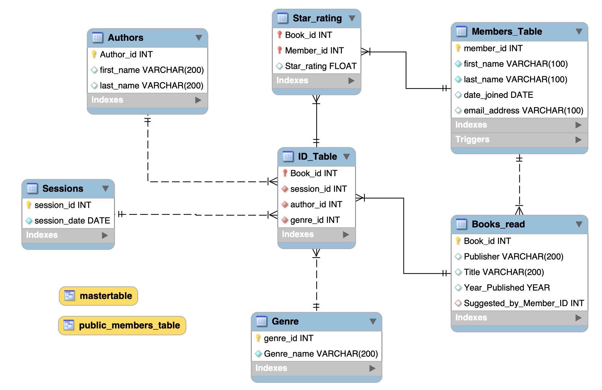

<!DOCTYPE html>

# MySQL BookClub Repository 📚

## 💬 About 
A Solo Project created during my CodeFirstGirls: Introduction to Data and SQL. This was an eight week course, in which I learned the fundamentals of SQL in Sep-Nov 2022.

This project is a database to track the activity of a growing Bookclub, and includes user-friendly features designed to be useful and insightful for its members.

It includes tables detailing the Members, Author information, details about each Book read in the bookclub, Genres, Session information such as dates, as well as a star rating table. 

I challenged myself to complete all of the advanced options within the project brief.

A summary can be found in the [Project Presentation](https://github.com/elliepriestley/MySQL_Bookclub_Repository/blob/main/Project_Presentation/Presentation_SQLDataProject_08.11.22.pdf)

## 🚀 Tech Stack
 

## ⚡️ Features

- Relational database, with useful joins and views to query
- Graded star rating system
- Reoccurring event to plan the next book club date

## 📦 Structure 

 

All tables are related directly or indirectly to the ID table, which I used to store and ensure the integrity of all the IDs. Views are displayed in yellow.

### Joins
I used joins to group the data in a logical way. The most complex and interesting join is my MasterTable join. I used multiple joins to display all relevant information from 6 tables, via the ID Table. I concatenated the names of the authors and members for clarity, aliased the columns and used a subquery to find the average star rating, grouped by each book. Finally, I ordered it by Average Star Rating descending from best to worst. I then used this query to create a view, so it would be easily queried and accessible.

### Queries

I included some example queries in the Project Demo:

- Finding the title and genre of each book given an average of 7 stars or more
- Finding out how many members have successfully suggested more than one book
- Finding out which genre the Bookclub has covered the least amount of times

### Stored Functions, Procedures, Events and Triggers

- Stored Function to turn the Average Star Ratings into a Graded rating system 
- Stored Procedure to easily remind us of the founding members of the bookclub
- Stored Procedure to easily plan when the next Bookclub should take place. 
- Reoccurring event to plan the sessions in advance.
- Trigger to ensure that member names are inserted into the table with sentence case, to improve data integrity 
